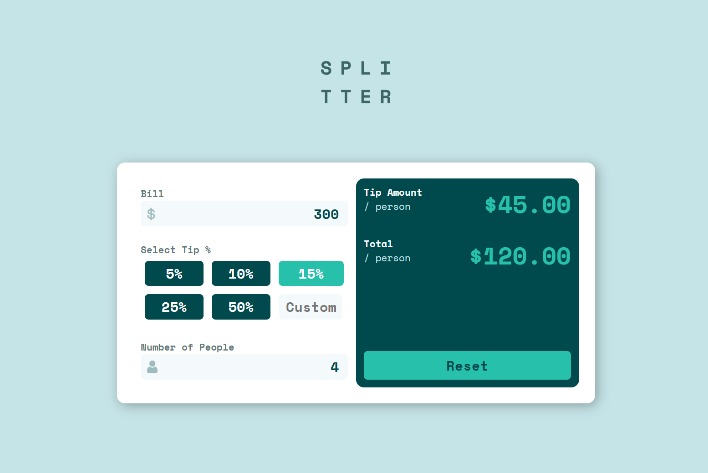
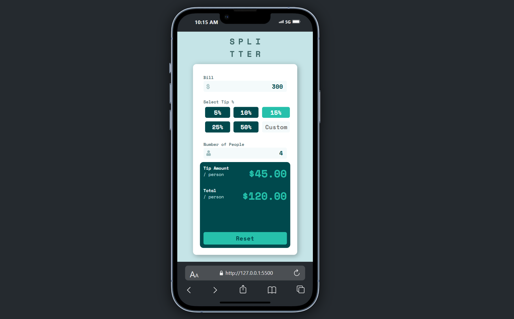

# 💰 Tip Calculator App



A simple and responsive Tip Calculator web app built with **HTML**, **CSS**, and **JavaScript**. It helps users quickly calculate the tip amount and total bill per person.

---

## 🚀 Features

- Easy-to-use interface  
- Calculates tip amount and total per person  
- Responsive design for mobile and desktop  
- Clean and modern UI  

---

## 🛠️ Built With

- HTML  
- CSS  
- JavaScript  

---

## 📸 Mobile View



---

## 📂 How to Use

1. Clone the repository  
   ```sh
   git clone https://github.com/Amine4jh/tip-calculator-app.git
   ```
2. Open `index.html` in your browser  
3. Enter the bill amount, select tip %, and number of people  
4. View the calculated results instantly

## 🙌 Acknowledgments

- Inspired by real-world utility apps  
- Built for learning and practice